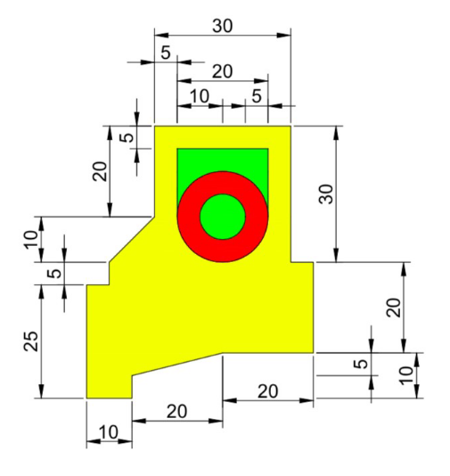

# Atividade 1 de computação Gráfica

### **Professor** [Dr. Glaucius Décio Duarte](http://www2.pelotas.ifsul.edu.br/glaucius/cg/index.html)
### **Aluno** Sthefano Soares Schiavon
### **Disciplina** Computação Gráfica
### **Data** 07/09/2022
---
## 1. Objetivo do trabalho

Renderizar a imagem abaixo com OpenGL, usando C++.


## 2. Excecução do projeto

O projeto foi desenvolvido no sistema MacOS, na IDE Xcode. Depois foi adaptado para executar também no Linux.

### 2.1 MacOS
TO-DO

### 2.2 Linux

O autor executou o projeto no Ubuntu 18.04.6 LTS, que pode ser encontrado [neste link](https://releases.ubuntu.com/18.04/). Para isso, são necessários os seguints comandos:

#### Passo 1 - Instalar GIT
```shell 
sudo apt update
```
```shell 
sudo apt install git
```

#### Passo 2 - Instalar GLUT
```shell
apt-get install freeglut3 freeglut3-dev
```

#### Passo 3 - Instalar G++
```shell
sudo apt install g++
```

#### Passo 4 - Clonar este repositório
Desse passo em diante deverá ser preciso cuidar em qual pasta o projeto foi clonado. Assumirei que isso foi feito na home, poor isso o próximo comando.
```shell
cd ~
```
```shell
git clone https://github.com/sthefanoss/comp_grafica.git
```
Com isso, uma pasta comp_grafica será criada.
#### Passo 5 - Compilar projeto
Agora é necessário entrar na pasta onde está o arquivo main.cpp.
```shell
cd comp_grafica/computacao_grafica/src
```
```shell
g++ models/*.cpp  utils/*.cpp main.cpp -o main -lglut -lGL -lGLU
```
O último comando compila cada um dos arquivos e gera um executável main na mesma pasta.
#### Passo 6 - Executar projeto
Por último, basta rodar o comando abaixo para ver uma janela com o desenho renderizado.
```shell
./main
```

